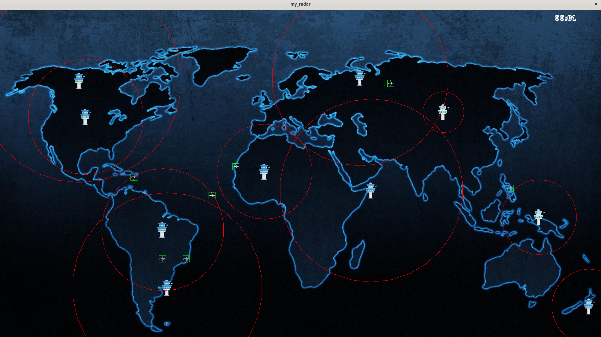

MY_RADAR

Description : 

Ce projet est un simulateur de trafic aérien en 2D développé en C, utilisant la bibliothèque CSFML.
Il simule le mouvement d'avions et l'influence des tours de contrôle, avec des règles strictes pour gérer les interactions entre ces entités.




Fonctionnalités :

> Simulation de Mouvement d'Avions : Les avions se déplacent de leurs points de départ vers leurs destinations.
> Affichage des Tours de Contrôle : Les tours de contrôle sont présentes dès le lancement de la simulation.

Installation et Exécution :
  Prérequis
> GCC Compiler
> CSFML Library


Instructions : 


1 > Clonez le répertoire

```git clone https://github.com/EpitechPromo2028/B-MUL-100-LIL-1-1-myradar-yanis.asselman.git```


2 > Compilez le Projet

```cd B-MUL-100-LIL-1-1-myradar-yanis.asselman```

```make```

3 > Exécutez le Simulateur

```./my_radar path_to_script```

Utilisation

> Lancez la simulation avec un script décrivant les avions et les tours de contrôle. Des interactions clavier sont disponibles :

Quitter : Appuyez sur Q pour quitter la simulation.

Hitboxes et Zones : Appuyez sur L pour activer/désactiver leur affichage.

Sprites : Appuyez sur S pour activer/désactiver l'affichage des sprites.

Script de Simulation

Le script (path_to_script) doit décrire les avions et les tours de contrôle

Options

> -h : Affiche l'usage et quitte le programme.


Il se peut que le programme puisse faire un écran noir à l'execution, si tel est le cas quittez le avec "Q" et réessayer ca peut se produire deux ou trois fois pour une raison que je n'ai malheureusement pas su identifer.
